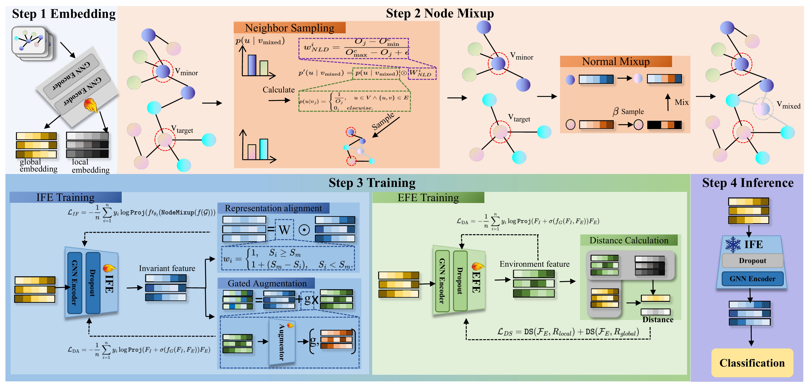

# GraphIFE

GraphIFE is research code for long-tailed node classification. It includes the
GraphIFE training pipeline and GCN/GATv2/GraphSAGE backbones for Planetoid,
Amazon, and Coauthor-CS datasets.



## Repository layout

- `main.py`: training entry point.
- `args.py` and `config.yaml`: command-line and default configuration.
- `data_utils.py`: dataset loading, long-tail split construction, optimizers,
  and result reporting.
- `models/`, `nets/`, and `losses/`: GraphIFE components, GNN backbones, and
  loss functions.

The current source tree excludes datasets, TensorBoard logs, result files,
parameter sweeps, and historical experiment archives.

## Installation

Use Python 3.9 or later. Install a PyTorch build compatible with your CUDA
runtime (or a CPU-only build) first, then install the remaining dependencies:

```bash
pip install -r requirements.txt
```

`torch-scatter` and `torch-sparse` contain compiled extensions. If the standard
installation does not provide a wheel for your PyTorch/CUDA combination, install
the matching wheels before rerunning the command above.

## Usage

The 27 settings listed in `config.yaml` are the complete public parameter set.
Command-line options override values from the selected YAML file. Unknown YAML
keys and unsupported command-line options are rejected. Boolean options accept
`true` and `false`. Datasets are downloaded to `./data` on first use.

Training uses Beta(2, 2) feature mixing and selects the best epoch by validation
accuracy. Neighbor duplication is used during warmup, followed by neighbor
sampling. The number of synthetic nodes follows the class-balancing rule, and
task losses use dynamic weighting based on their ratios between epochs.

```bash
python main.py --config config.yaml
```

For a lightweight CPU smoke run, override the relevant options:

```bash
python main.py --dataset Cora --net GCN --device cpu --epochs 2 --repetitions 1
```

To write a summary to `result/` or TensorBoard logs to `runs/`, opt in with
`--write true` and/or `--verbose true`.
